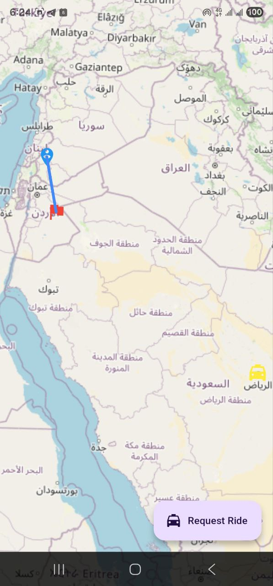
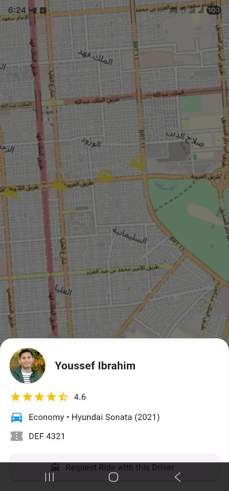
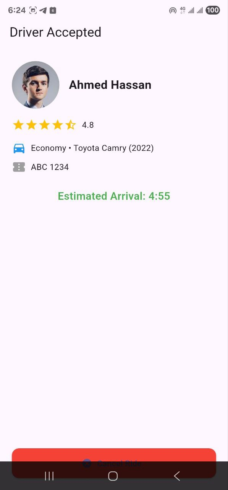
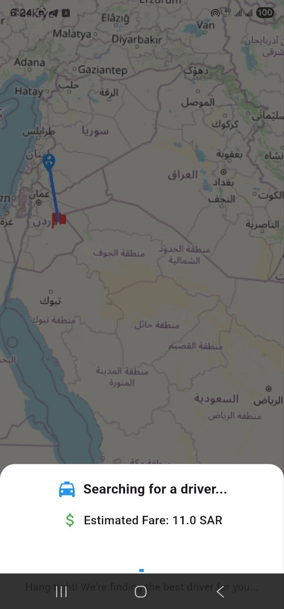

# 🚖 Taxi Booking App

A Flutter-based mobile application for booking taxis.  
This project demonstrates **Bloc state management**, **clean architecture principles**, and **modern UI/UX patterns**.


---


## ✨ Features
- 🗺️ Interactive map with pickup & destination markers
- 🚕 Driver discovery with detailed info sheets
- 💰 Ride request flow with dynamic fare calculation
- ⏱️ Driver acceptance screen with ETA countdown

---

## 📱 Screenshots
<p align="center">
  
  
  
  
</p>

---

## 🛠️ Tech Stack
- **Flutter** — UI framework
- **Dart** — programming language
- **flutter_bloc** — state management
- **flutter_map** — map rendering
- **go_router** — navigation
- **latlong2** — map coordinates
- **Firebase** — analytics

---

## 📂 Project Structure
lib/
    ┣ core/                # Shared services & routing 
    ┣ features/ ┃
                ┗ booking/ 
                    ┃   
                    ┣ data/            # Models & repositories 
                    ┣ domain/          # Use cases 
                    ┗ presentation/    # UI screens & widgets 
    ┗ main.dart            # Entry point

---

## 🚀 Getting Started

### Prerequisites
- Flutter SDK (>=3.0)
- Android Studio or VS Code
- Emulator or physical device

### Installation
```bash
git clone https://github.com/TuqaBakr/taxi-booking.git
cd taxi_booking
flutter pub get
flutter run

```
🧪 Testing
This project includes unit tests, repository tests, and widget tests to ensure reliability and maintainability.
Domain Tests
  Path: test/features/booking/domain/calculate_fare_usecase_test.dart
  Covers:
- ✅ Fare calculation for Economy, Comfort, and Premium
- ✅ Minimum fare enforcement when distance is too short
- ✅ Correct application of base fare + perKmRate

Repository Tests
  Path: test/features/booking/data/repositories/booking_repository_impl_test.dart
  Covers:
- ✅ Successful API response → returns BookingResponseModel with available drivers only
- ✅ Network failure (e.g., no internet) → returns NetworkFailure
- ✅ Empty driver list → still parses FareRulesModel correctly

Widget Tests
Path: test/features/booking/presentation/widgets/
- driver_info_sheet_test.dart
  Ensures driver info (name, car details, rating stars) renders correctly.
- ride_requested_sheet_test.dart
  Ensures the ride request bottom sheet shows estimated fare, spinner, and friendly message.

Running Tests
Run all tests:
```flutter test```
Run a specific test file
```flutter test test/features/booking/domain/calculate_fare_usecase_test.dart```
Run tests by name:
```flutter test --name "should calculate fare for Economy correctly"```


⚙️ CI/CD
This project uses GitHub Actions to run tests automatically on every push.
Pipeline includes:
- ✅ flutter analyze — must pass with no errors
- ✅ flutter test — all tests must pass
- ✅ Build APK and upload as artifact
  You can check the latest workflow runs in the Actions tab.


🤝 Contributing
Pull requests are welcome!
For major changes, please open an issue first to discuss what you’d like to change

📄 License
This project is licensed under the MIT License.
---


